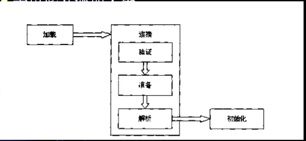
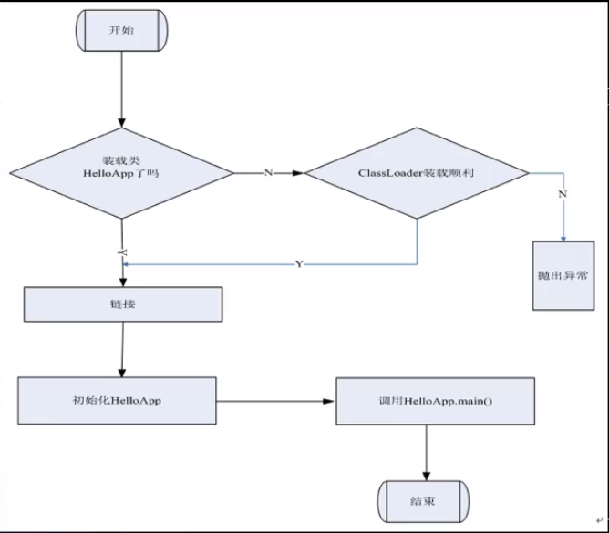
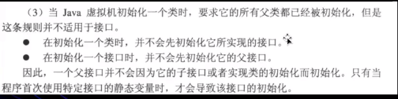
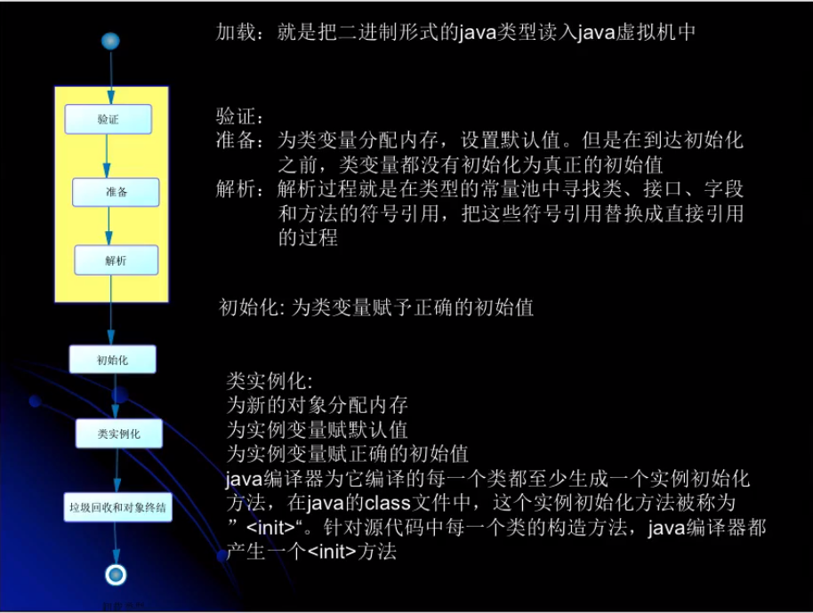
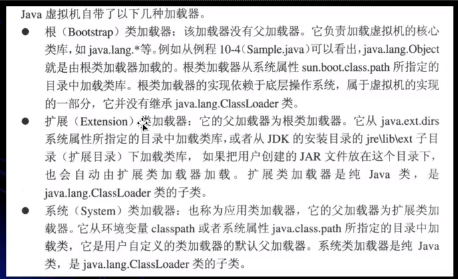
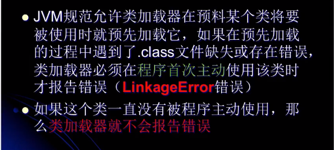
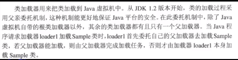
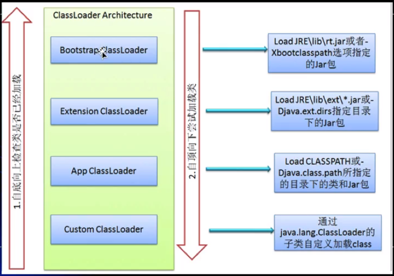

## JVM学习笔记

### 1、类加载

类型的加载、连接与初始化过程都是在程序运行期间完成的

 #### 1.1加载

查找并加载类的二进制数据。

将类的.class文件中的二进制数据读入到内存中，将其放在运行时数据区的方法区内，然后创建一个java.lang.Class的对象，用来封装类在方法区内的数据结构。

加载.class文件的方式：本地文件、网络、zip或jar等归档文件、从数据库中加载、将java源文件动态编译成.class文件。

#### 1.2连接

验证：确保加载的类的正确性

准备：为类的静态变量分配内存，并且将其初始化为默认值。

解析：把类中的符号引用转化为直接引用

#### 1.3初始化

为类的静态变量赋予正确的初始值

类的初始化时机（除了一下七种，其他被动使用不会导致类的初始化）：

​	1、创建类的实例

​	2、访问类或接口的静态变量，或者对该静态变量赋值

​	3、调用类的静态方法

​	4、反射（如Class.forName("com.youxu.Test")）

​	5、初始化一个类的子类

​	6、jvm启动时被标明为启动类的类

​	7、 JDK1.7提供的静态语言支持：java.lang.invoke.MethodHandle实例的解析结果REF_getStatic,REF_putStatic,REF_invokeStatic句柄对应的类没有初始化，则初始化。

### 类加载器

java虚拟机自带的加载器：

​	根类加载器（Bootstrap ClassLoader）

​	扩展类加载器（Extension ClassLoader）

​	系统类加载器（System ClassLoader）

用户自定义加载器：需要继承Classloader

类加载器并不需要等到某个类被“首次主动使用”时才加载。

类加载器的双亲委托机制

